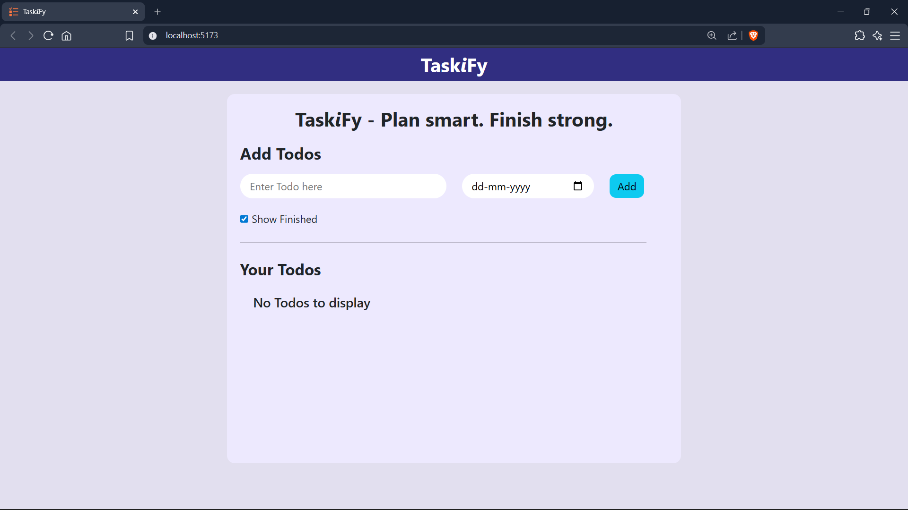
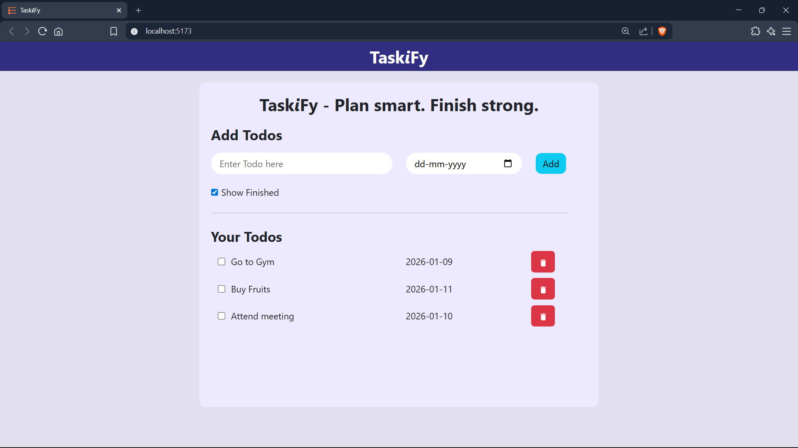
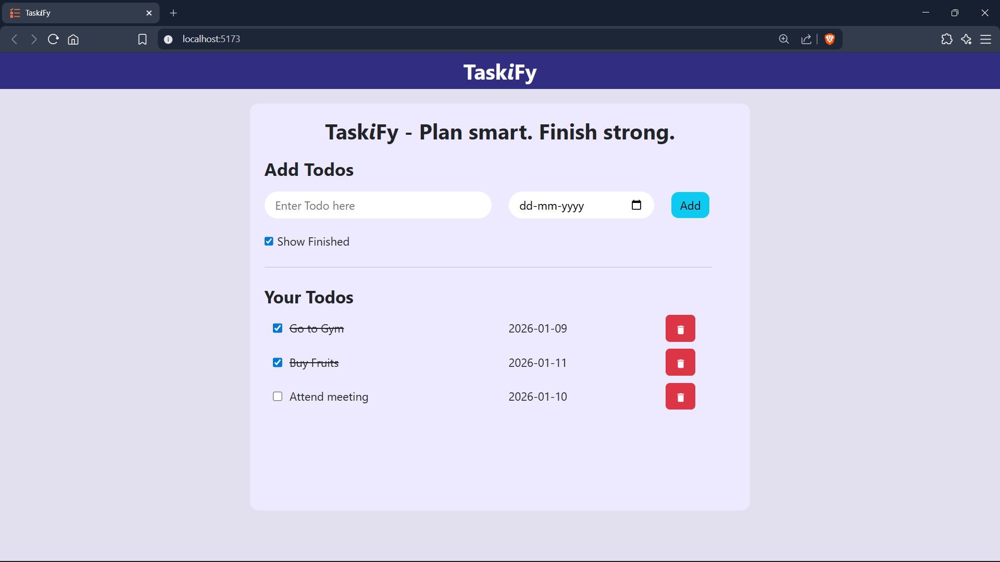

# ✅ TaskiFy – A Simple & Smart Todo App

TaskiFy is a clean and user-friendly **Todo List application built with React**.
It helps users organize tasks efficiently, track completion status, and manage daily work with ease.

---

## 🚀 Features

* 📝 Add new todos with due dates
* ✅ Mark tasks as completed
* 🗑️ Delete todos
* 👀 Show / hide completed tasks
* 📅 Native date picker support
* 🎨 Clean UI using Bootstrap & CSS Modules

---

## 🛠️ Tech Stack

* **React** (Hooks: `useState`, `useEffect`)
* **JavaScript (ES6+)**
* **Bootstrap**
* **CSS Modules**
* **React Icons**

---

## 📸 Screenshots

### Home Page


### Add Todo


### Completed Todo



---

## ⚙️ Installation & Setup

1. Clone the repository:

   ```bash
   git clone https://github.com/your-username/todo-list.git
   ```

2. Navigate to the project folder:

   ```bash
   cd todo-list
   ```

3. Install dependencies:

   ```bash
   npm install
   ```

4. Start the development server:

   ```bash
   npm run dev
   ```

   or

   ```bash
   npm start
   ```

---

## 📂 Project Structure

```
src/
├── components/
│   ├── AddTodo.jsx
│   ├── TodoItem.jsx
│   ├── ShowFinished.jsx
│   ├── Navbar.jsx
│   └── AppName.jsx
├── App.jsx
├── App.css
```

---

## 💡 Learning Outcomes

This project helped me strengthen my understanding of:

* React component architecture
* State & props management
* Conditional rendering
* Handling user interactions
* Styling with CSS Modules
* Building reusable components

---

## 🔮 Future Improvements

* ✏️ Edit todo feature
* 💾 LocalStorage persistence
* 🌙 Dark mode
* 📱 Improved mobile responsiveness

---

## 👤 Author

**Arjun Rathore**

Student & Frontend Developer

🔗 LinkedIn: [Arjun Rathore](https://www.linkedin.com/in/arjun-rathore-454671326)  
🐙 GitHub: https://github.com/Arjun-19A

---

## ⭐ Show your support

If you like this project, consider giving it a ⭐ on GitHub!
